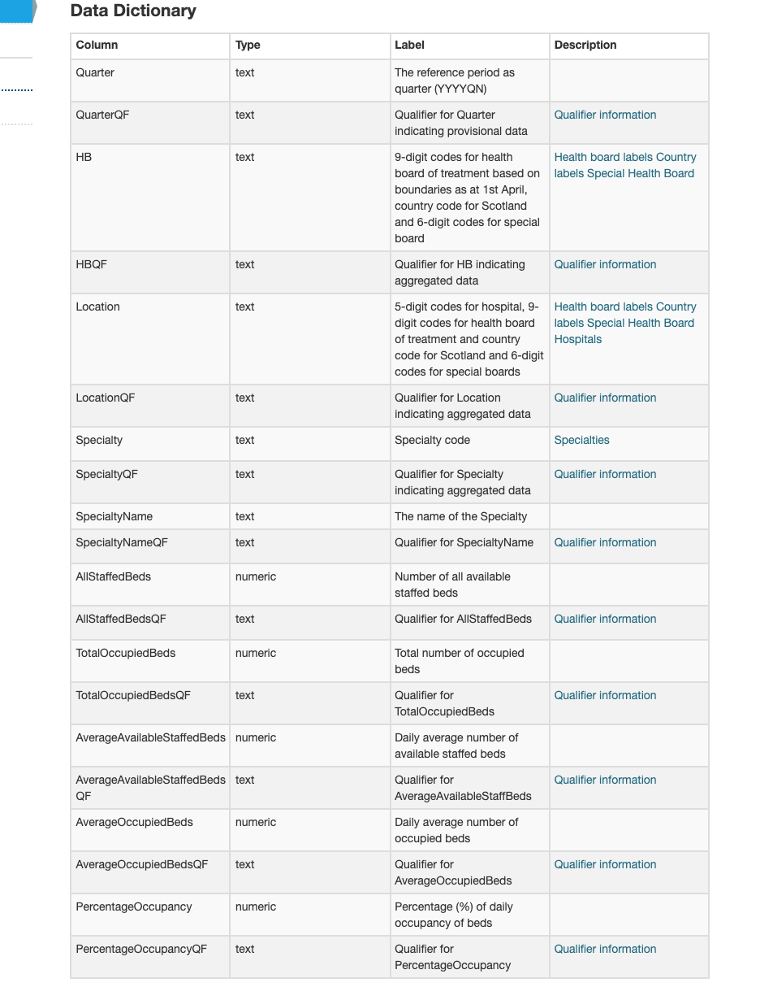

```{r setup, include=FALSE}
knitr::opts_chunk$set(echo = TRUE)
```

```{r, warning=FALSE, message=FALSE}
library(tidyverse)
library(janitor)
library(jsonlite)
```
In order to provide an effective, safe and efficient service to patients, hospitals must balance the provision of staffed beds against anticipated demand. Historically, the total number of beds has been reducing in line with evolving models of healthcare provision which aim to reduce the frequency and duration of hospital admissions and improve the integration of health and social care services. This strategy aims to improve outcomes for patients and reduce the likelihood of future hospital admissions.
```{r}
bed_by_bord_url <- paste0("https://www.opendata.nhs.scot/api/3/action/datastore_search?resource_id=f272bb7d-5320-4491-84c1-614a2c064007&limit=3000")
```

```{r}
bed_by_bord_json <- fromJSON(bed_by_bord_url, flatten = TRUE)
```

```{r}
 bed_by_bord <- bed_by_bord_json$result$records
bed_by_bord <- bed_by_bord %>% 
  clean_names()
```

 
 
```{r}
bed_by_bord %>% 
  distinct(hb)
```
 
 
 
 
 
 
 
 [codes for the dataset](https://www.opendata.nhs.scot/dataset/hospital-beds-information/resource/f272bb7d-5320-4491-84c1-614a2c064007)