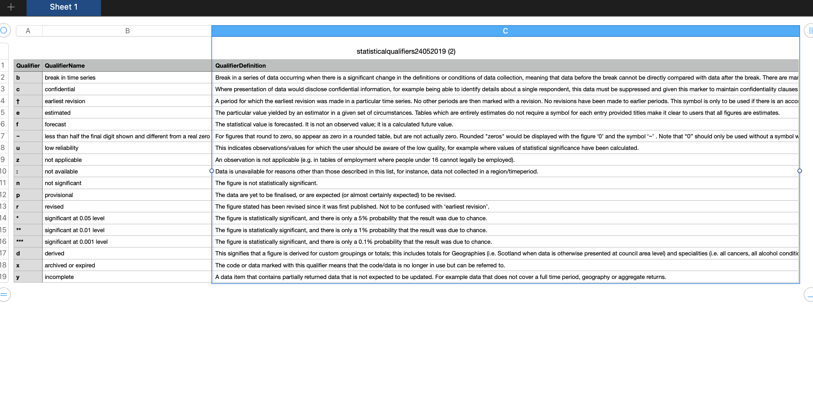
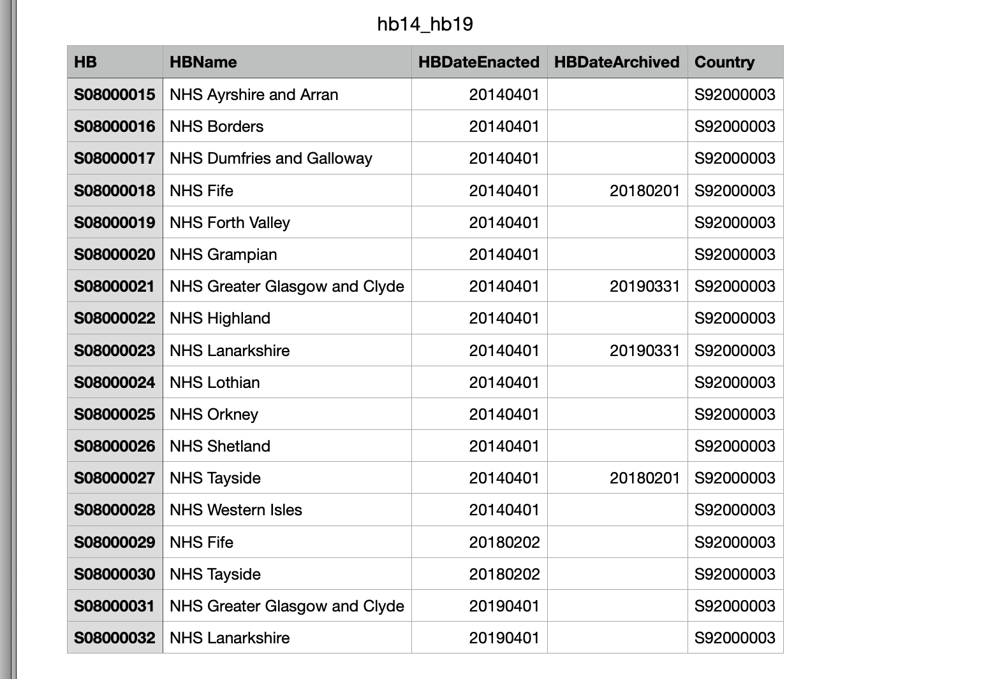
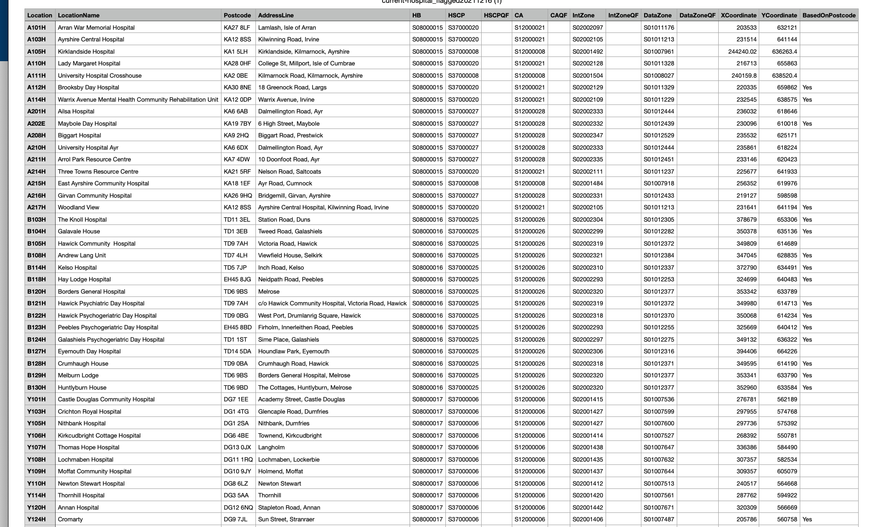

```{r setup, include=FALSE}
knitr::opts_chunk$set(echo = TRUE)
```

```{r, warning=FALSE, message=FALSE}
library(tidyverse)
library(janitor)
library(jsonlite)
```

Key statistics on new and unplanned return attendances at Accident and Emergency (A&E) services across Scotland. The information presented includes trends in the number of attendances and admissions, and performance against the four hour waiting time standard.

```{r}
a_and_a_url <- paste0("https://www.opendata.nhs.scot/api/3/action/datastore_search?resource_id=2a4adc0a-e8e3-4605-9ade-61e13a85b3b9&limit=15410")
```

```{r}
a_and_e_json <- fromJSON(a_and_a_url, flatten = TRUE)
```

```{r}
 a_and_e <- a_and_e_json$result$records
head(a_and_e)
```


```{r}
a_and_e %>% 
  glimpse()
```


```{r}
a_and_e %>% 
  clean_names()
```


[codes for the dataset](https://www.opendata.nhs.scot/dataset/monthly-emergency-department-activity-and-waiting-times/resource/2a4adc0a-e8e3-4605-9ade-61e13a85b3b9)




```{r}
a_and_e %>% 
  distinct(Month) %>% 
  arrange()
```


