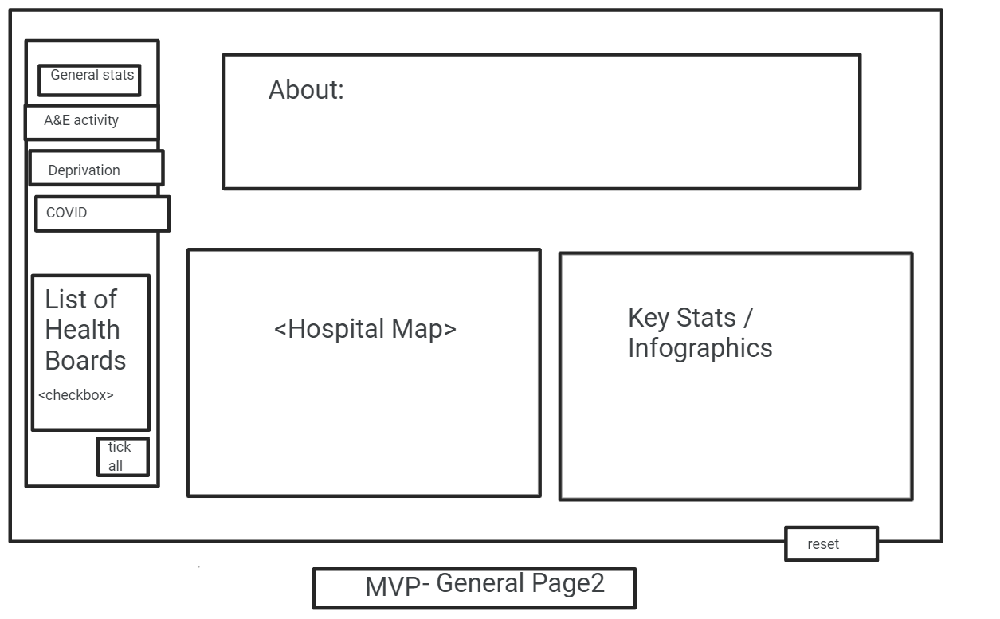

```{r setup, include=FALSE}
knitr::opts_chunk$set(echo = TRUE)
```
# **Name of Dashboard**

### Members of Team KLAS

* Aboubakar Hameed
* Kang Hin Lee
* Lucy Burns
* Seàn M. Cusick

### Roles & responsibilities of each member
<!-- additional supported WPs To be completed on Thursday -->
* **Aboubakar Hameed** was responsible for `Work Package 2.3 - Shiny App MVP`; furthermore, supported <spatial visualisations>, <data cleaning>,... 

* **Kang Hin Lee** was responsible for `Work Package 2.1 - Data Analysis`; furthermore, supported <spatial visualisations>, <data cleaning>,... 

* **Lucy Burns** was responsible for `Work Package 2.2 - Data Analysis`; furthermore, supported <spatial visualisations>, <data cleaning>,... 

* **Seàn M. Cusick** was responsible for  `Work Package 1 - Project Management` & `Work Package 3 - Documentation`; furthermore, supported <spatial visualisations>, <data cleaning>,...  

* **All team members** worked on the following **Work Packages** (WP):  
  * `WP1.1 - Project Set-up`  
  * `WP2 - Shiny App`  
  * `WP2.1.1 - DataSet Selection ` 
  * `WP2.1.2 - Data Cleaning`  
  * `WP2.1.3 - Data Wrangling`  
  * `WP2.2.1 - Temporal Visualisations`  
  * `WP2.2.2 - Spatial Visualisations`  
  * `WP2.2.3 - Demographic Visualisations`   
  * `WP2.2.4 - Features`  
  * `WP2.3.1 - User Interface`  
  * `WP2.3.2 - Backend Code`  
  * `WP3.1 - Report`  
  * `WP3.1.1 - Analysis`  
  * `WP3.1.2 - README File`  
  * `WP3.2 - Presentation`  
   

### Brief description of dashboard topic

The objective of this project is the creation of a dashboard which can demonstrate the affect that the Winter season has on the acute health sector in Scotland.  

In order to realise this objective, a preliminary wire-frame of the end product was designed during the Initial Design Review (IDR) in `WP1.1 - Project Set-up`. More information on the design reviews is found in a later section.  

  
  
The Minimum Value Product (MVP) of the dashboard, found in `WP 2.3 - Shiny App MVP`, can be separated into sidebar, with each tab displaying relevant information. 
* The main, or **General Stats** page, can be divided into three key sections:  
  * An about section  
  * A map displaying hospital locations and Health Board areas  
  * A graph displaying <hospital addmsion since 2016, and COVID-19 related admission>  
* The first page, or **A&E Activity** page, can be divided into three key sections:  
  * A heat map of where there is the most admissions  
  * A time series of a&e activity from *2020* to *2021* ??? 
  * A graph displaying <...>  
* The second page, or **Deprivation page** page, which was re-prioritised after the Detailed Design Review (DDR) from the `WP 2.3 - Shiny App MVP` to `WP2.2.4 - Features`, can be divided into three key sections:  
  * A heat map of where there is the most addmissions  
  * A time series of a&e activity from *2020* to *2021* ??? 
  * A graph displaying <...>    
* The third page, or **COVID-19** page, can be divided into three key sections:  
  * A heat map of where there is the most cases  
  * A time series of covid cases from *2020* to *2021* ??? 
  * A graph displaying <...>  


Additionally, `WP2.2.4 - Features` added the following aspects to the Shiny App:
1. checkboxes of each health board
2. drop down menu for individual hospitals in that health board
3. Tabs
  1). Map of Scotland
  2). Time series graphs
  3). proportional graphs
4. buttons such as:
  * reset
  * select all
* stats on deprivation
* custom palettes, colour blind friendly
* forecasting

The topic of our MVP is looking specifically at Accident and Emergency (A&E)

The dashboard outlines our topic in terms of ...

***  

### Stages of the project

* Role Allocation  
* Project Management  
  * Work Breakdown Structure  
  * Project Gantt  
  * Git branching  
  * Version control  
* Application Development  
  * Choosing datasets  
  * Dashboard wireframe  
***

#### **Role Allocation**

asdf

#### **Project Management**

asdf


##### Work Breakdown Structure

asdf


##### Project Gantt

asdf


##### Git branching

asdf


##### Version Control

asdf


#### **Application Development**

asdf


##### Dataset Selection

asdf

##### Dashboard wireframe

asdf

***

### Which tools were used in the project

* Discord (daily stand-ups, occasional mob programming, sharing ideas and links)
* GitHub/Projects (Project Management - Kaban Board)
* Git/GitHub (collaboration & version control)
* Microsoft Word (Work Breakdown Structure
* Microsoft Excel (Gantt Chart)

and so on ...

### How did you gather and synthesise requirements for the project?

We synthesised the information given in the brief by ...

We prioritised ...

### Motivations for using the data you have chosen

We used the dataset on ... to answer ... and because it was ...

### Data quality and potential bias, including a brief summary of data cleaning and transformations

According to the About tab on the dataset page/dedicated page online, the data quality ...

The dataset may/may not be biased because ...

To clean the datasets we ...

### How is the data stored and structured

[**Hint**: This page offers a good starting point for understanding the data structure: https://guides.statistics.gov.scot/article/34-understanding-the-data-structure]

The data is in the form of ...

This means ...

Benefits of storing the data like this are ...

### Ethical and legal considerations of the data

[**Hint:** this page contains information on the Open Government License which covers most datasets on statistics.gov.scot: http://www.nationalarchives.gov.uk/doc/open-government-licence/version/3/]

There are no/There may be ethical considerations, because ...

The datasets are covered by the Open Government License, which means ...