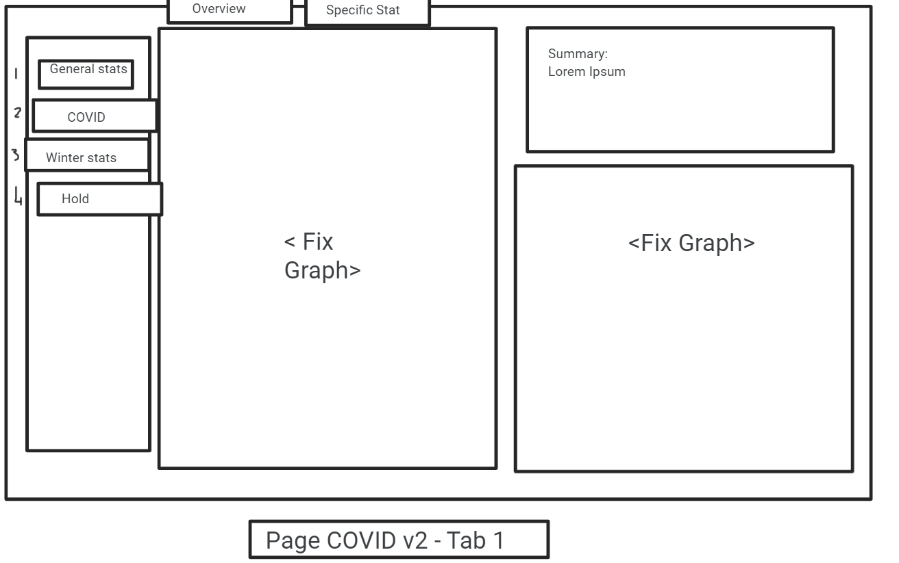
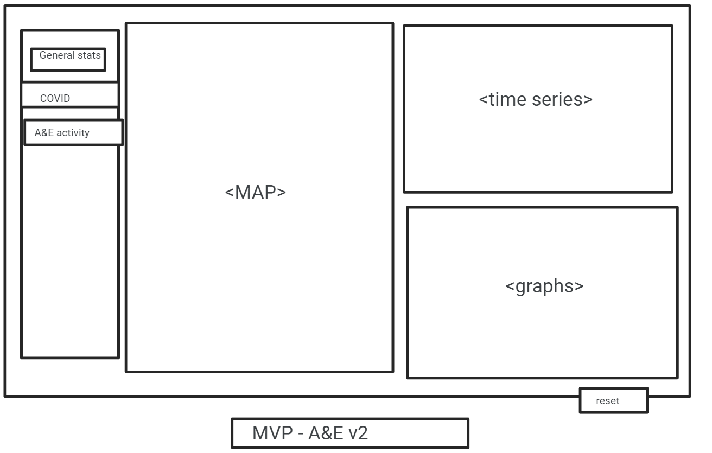

```{r setup, include=FALSE}
knitr::opts_chunk$set(echo = TRUE)
```

# Project Team Details {.tabset}

The following section introduces the members of Team KLAS, the project team that worked on **Name of Dashboard**. Each tab display an aspect of the Team and their goals.

## Members of Team KLAS

* **Aboubakar Hameed**  
* **Kang Hin Lee**  
* **Lucy Burns**  
* **Seàn M. Cusick**  

***  

## Team learning goals  
In the Kick-Off meeting, each member discussed their personal goals in regards to the knowledge they wished to consolidate and any new skill they wanted to learn:  

* **Aboubakar Hameed** -  
  *LOREM IPSUM.*  

* **Kang Hin Lee** -  
  *LOREM IPSUM.*  

* **Lucy Burns** -  
  *""I really wanted to explore the mapping systems within Leaflet and RStudio. I wanted to reinforce all of my learnings over the past seven weeks and improve my coding and visualising skills. I don’t think I have achieved these and have found this week frustrating - mostly at my own inexperience and problematic datasets. It has however not all been negative with a sharp learning curve for me, and I think, my team."*  

* **Seàn M. Cusick** -  
  *planned to solidify his experience in Project Management by incorporating his knowledge in leading Event and Technical Projects, into leading a Software based project. Additionally, to improve his working experience with spatial visualisations. *
  
  
***  

## Roles & Responsibilities
<!-- additional supported WPs To be completed on Thursday -->
* **Aboubakar Hameed** -  
  responsible for the Minimum Viable Product (MVP) - summarised within Work Package (WP) `WP2.3 - Shiny App MVP`; furthermore, supported *<spatial visualisations>, <data cleaning>,...* 

* **Kang Hin Lee** -  
  responsible for the Data Sets - summarised in `WP2.1 - Data Analysis`; furthermore, supported *<spatial visualisations>, <data cleaning>,... *

* **Lucy Burns** -  
  responsible for the visualisations - summarised within WP `WP2.2 - Data Visualisation`; furthermore, supported *<spatial visualisations>, <data cleaning>,...* 

* **Seàn M. Cusick** -  
  responsible for Project Management and Documentation - summarised within WP `WP1 - Project Management` & `WP3 - Documentation`; furthermore, supported *<spatial visualisations>, <data cleaning>,...*  
  
***  

## Team Responsibilities
* **All team members** worked on the following **Work Packages** (WP):  
  * `WP1.1 - Project Set-up`  
  * `WP2 - Shiny App`  
  * `WP2.1.1 - DataSet Selection ` 
  * `WP2.1.2 - Data Cleaning`  
  * `WP2.1.3 - Data Wrangling`  
  * `WP2.2.1 - Temporal Visualisations`  
  * `WP2.2.2 - Spatial Visualisations`  
  * `WP2.2.3 - Demographic Visualisations`   
  * `WP2.2.4 - Features`  
  * `WP2.3.1 - User Interface`  
  * `WP2.3.2 - Backend Code`  
  * `WP3.1 - Report`  
  * `WP3.1.1 - Analysis`  
  * `WP3.1.2 - README File`  
  * `WP3.2 - Presentation`  

   
***  
# Dashboard Details

## MVP Objective
The topic of our MVP is to demonstrate the __effect Winter__ has on the acute Health Sector in Scotland, specifically __within Accident and Emergency (A&E)__, with a focus on the __COVID-19 pandemic's additional influence.__ 

The dashboard outlines our topic in terms of:
* The geographic spread of the Scottish Health Service
* COVID-19's spread through Scotland
* The activity within A&E departments in Scotland.


## Initial MVP (IDR) 
In order to realise this objective, a preliminary wire-frame of the Minimal Viable Product (MVP) was designed during the Initial Design Review (IDR) in `WP1.1 - Project Set-up`. This wire-frame can be found in the annex.  

## Revised MVP (DDR) {.tabset}
During the Detailed Design Review (DDR), the design was further streamlined, with superfluous features moved to the `WP2.2.4 - Features` work package. The updated wire-frames can be found in the tabs below: 

### General Page  
  

### COVID Page - Tab 1  
  

### COVID Page - Tab 2  
  

### A&E Page  



## MVP Detail {.tabset}
The Minimum Value Product (MVP) of the dashboard, found in work package `WP 2.3 - Shiny App MVP`, can be separated into a sidebar, with each tab displaying relevant information. Details on the page contents can be found in the tabs below:

### Landing Page
The main, or **General Statistics** page, can be divided into three key sections:  
  * An about section  
  * A map displaying hospital locations and Health Board areas  
  * A section displaying key statistics, e.g.  _<hospital admission since 2016, and COVID-19 related admission>_, with a drop-down menu to select Health Board  
  
***  

### Page 1
The first page, or **COVID-19** page, can be divided into Two tabs:  
  * The first tab displays three key sections:  
    * A summarisation of the results  
    * A fixed graph displaying ... 
    * A fixed graph displaying ... 
  * The second, optional tab that displays an interactive graph:  
  
***  

### Page 2
The second page, or **A&E Activity*** page, , can be divided into three key sections:  
  * A heat map of where there is the most admissions  
  * A time series of a&e activity from *2020* to *2021* ??? 
  * A graph displaying <...>  
  
***  

### Page 3 
The third page which was re-prioritised after the Detailed Design Review (DDR) from the `WP 2.3 - Shiny App MVP` to `WP2.2.4 - Features`, *would have been* divided into three key sections:  
  * A heat map of where there is the most cases  
  * A time series of COVID cases from *2020* to *2021* ??? 
  * A graph displaying <...>  
  
***  

### Additional Features
Additionally, `WP2.2.4 - Features` added the following aspects to the Shiny App to be worked on after the completion of the MVP:
1. Interactivity of the Shiny App  
2. check boxes of each health board
3. drop down menu for individual hospitals in that health board
4. Tabs
  1). Map of Scotland
  2). Time series graphs
  3). proportional graphs
5. buttons such as:
  * reset
  * select all
6. Statistics on deprivation
7. custom palettes, colour blind friendly
8. forecasting

***

# Project Details

## Stages of the project

* **Role Allocation**  
* **Project Management**  
  * Work Breakdown Structure  
  * Project Gantt  
  * Design Reviews & Milestones
  * Git branching  
  * Version control  
* **Application Development**  
  * Choosing datasets  
  * Dashboard wire-frame

### **Role Allocation**

In our initial Kick-Off Meeting, the Team spoke about their strengths and weakness, as well as their learning goals for the project. From there, we spoke about which activities we would like to focus on. Each team member was keen on participating in most activities; to increase the efficiency of the team, each team member was allocated responsibility for a key work package. These responsibilities can be found in section `1.3`.

### **Project Management** {.tabset}

An AGILE-4DX hybrid approach was taken by the Project Manager to develop the Shiny App. This involved daily Stand Up meetings, utilisation of GitHub's inbuilt Kanban board as a dashboard to track the activities and progress, defined roles & responsibilities, clear Work Packages, a timeline for work to be done, and Lead-based Key Performance Indicators (KPIs).  
  
Aspects of the Project Management framework are included in the tabs below:

#### Project Objective
To design a dashboard with Shiny in R, that would display the affect that Winter had on the Scottish Health service, how COVID impacted this, and the geographical locations of Hospital within Scotland.

***
#### Project Key Performance Indicators
Key Performance Indicators, or KPIs, are a type of measurement used to track activities towards a goal. The project manager chose lead-based KPIs - that is, KPIs that aren't measured by outcome, but are measured by activity towards the outcome. 

Five KPIs were chosen for this project:   
* 2 Branch Commits per day  
* 1 Branch merges per day  
* 10,000 additions of code per day  
* 2 Stand-Up meetings per day  
* 5 minutes per person in Stand-Up meetings  

KPIs were tracked via GitHub:


***
#### Work Package Descriptions (WPD)

1. WP1 - Project Management:  
    
	
2. WP1.1		Project Set Up

3. WP2	Shiny App
		
4. WP2.1		Data Analysis
		Kang
5. WP2.1.1 			 Dataset Selection
			
			
6. WP2.1.2 			Data Cleaning

7. WP2.1.3			Data Wrangling

8. WP2.2		Data Visualisation
		Lucy
9. WP2.2.1  Temporal

10. WP2.2.2 			Spatial

11. WP2.2.3 			Demographics

12. WP2.3		Shiny App MVP
		Aboubakar
13. WP2.3.1			UI

14. WP2.3.2			Backend

15. WP2.4		Features
	
16. WP3 	Documentation
	Sean
17. WP3.1 		Report
			
18. WP3.1.1			Analysis

19. WP3.1.2			README

20. WP3.2 		Presentation


***
#### Work Breakdown Structure (WBS)

asdf

***
#### Project Gantt

asdf

***
#### Design Reviews & Milestones

asdf

***
#### Git branching

asdf

***
#### Version Control

asdf

***
### **Application Development** {.tabset}

asdf  
  
***  

#### Dataset Selection

asdf  
  
***  

#### Dashboard wireframe

asdf

***

## Project Tools{.tabset}
The tabs below display the tools selected and utilised for the duration of this project:

### Project Management
* GitHub Projects
  Milestones
  Kanban Board
* Microsoft Excel
   (Gantt Chart)
* Microsoft Word
   (Work Breakdown Structure  
  
***  

### Collaboration
* Discord
  (daily stand-ups, occasional mob programming, sharing ideas and links)
* GitHub
  Code Pairing
  Code Sharing
* Google Jamboard
  (collaborative Wire-frame)  
  
***  

### File Management
* GitHub
  Version Control
* RStudio
  File Creation  
  
***  

### Documentation

* GitHub/Projects (Project Management - Kaban Board)
* Git/GitHub (collaboration & version control)  
  
***  

# Data Set Details  

## Data Set Selection {.tabset}
### How did you gather and synthesise requirements for the project?

We synthesised the information given in the brief by ...

We prioritised ...

### Motivations for using the data you have chosen

We used the dataset on ... to answer ... and because it was ...

## Quality & Biases {.tabset}
### Data Quality 

including a brief summary of data cleaning and transformations

According to the About tab on the dataset page/dedicated page online, the data quality ...

### Challenges  
The deprivation data was confusing to use. Initially we thought that it would give us a good indicator of who was being admitted into hospital. What it seemed to reveal, however, was a ranking for all patients who were entering/being admitted to hospital so it was not possible to compare or track the rates by SIMD (Scottish Index of Multiple Deprivation) as roughly 20% of the people in the hospitals were allocated to each of the quintiles. Deeper analysis of the SIMD could possibly provide some interesting analysis but in the short time scale we had we devised to drop the data set.
The bed capacity dataset was incomplete. It looked like it would be a good statistic to use to look at how full the hospitals are. On further investigation, however, we noticed that the data was only for a couple of hospitals across two of the 13 Health Boards in Scotland.

### Potential Biases
The dataset may/may not be biased because ...


## Data Manipulation {.tabset}
### Data Cleaning
To clean the datasets we ...

### Data Wrangling


## How is the data stored and structured

[**Hint**: This page offers a good starting point for understanding the data structure: https://guides.statistics.gov.scot/article/34-understanding-the-data-structure]

The data is in the form of ...

This means ...

Benefits of storing the data like this are ...

## Data Ethics

[**Hint:** this page contains information on the Open Government License which covers most datasets on statistics.gov.scot: http://www.nationalarchives.gov.uk/doc/open-government-licence/version/3/]

There are no/There may be ethical considerations, because ...


## Legalality
legal considerations of the data - The datasets are covered by the Open Government License, which means ...

***  
  
# Appendix  {.tabset}  

## Glossary

## Data Sets

## Application Layout
  
## Initial Design Review output:  
  
  


