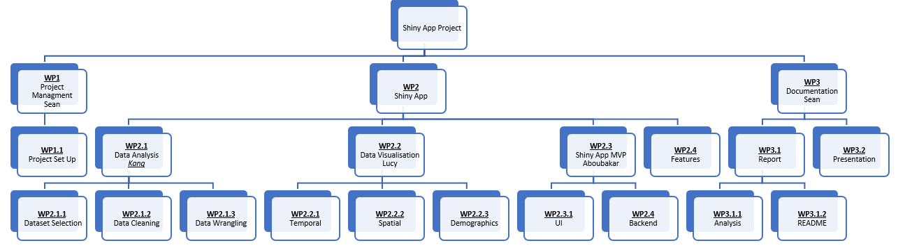

```{r setup, include=FALSE}
knitr::opts_chunk$set(echo = TRUE)
```

# Project Team Details {.tabset}

The following section introduces the members of Team KLAS, the project team that worked on __WAP SHS App__, also known as the **Winter Affectations post-2020 on the Scottish Health Sector Application**. Each tab display an aspect of the Team and their goals.

## Members of Team KLAS

* **Aboubakar Hameed**  
* **Kang Hin Lee**  
* **Lucy Burns**  
* **Seàn M. Cusick**  

***  

## Team learning goals  
In the Kick-Off meeting, each member discussed their personal goals in regards to the knowledge they wished to consolidate and any new skill they wanted to learn:  

* **Aboubakar Hameed** -  
  *My plan in this project was to get more experience in the shiny app, by exploring the relationship between the ui and the server as well as to get more knowledge and experience on how to create more tabs and improve the overall design of the app.*  

* **Kang Hin Lee** -  
  *"It is a very exciting opportunity to practise everything I have learned from CodeClan so far, using the live data from PHS. The aim for myself is to hone my data cleaning and wrangling skills and improve my analysis skills through working with my peers."*  

* **Lucy Burns** -  
  *"I really wanted to explore the mapping systems within Leaflet and RStudio. I wanted to reinforce all of my learnings over the past seven weeks and improve my coding and visualising skills. I don’t think I have achieved these and have found this week frustrating - mostly at my own inexperience and problematic datasets. It has however not all been negative with a sharp learning curve for me, and I think, my team."*  

* **Seàn M. Cusick** -  
  *planned to solidify his experience in Project Management by incorporating his knowledge in leading Event and Technical Projects, into leading a Software based project. Additionally, to improve his working experience with spatial visualisations. *


***  

## Roles & Responsibilities
* **Aboubakar Hameed** -  
  responsible for the Minimum Viable Product (MVP) - summarised within Work Package (WP) `WP2.3 - Shiny App MVP`; furthermore, supported `WP2.1.3 - Data Wrangling`, and `WP2.3.2 - Backend Code`.  

* **Kang Hin Lee** -  
  responsible for the Data Sets - summarised in `WP2.1 - Data Analysis`; furthermore, supported `WP2.1.3 - Data Wrangling`, and `WP2.3.2 - Backend Code`.

* **Lucy Burns** -  
  responsible for the visualisations - summarised within WP `WP2.2 - Data Visualisation`; furthermore, supported `WP2.1.3 - Data Wrangling`, `WP3.1.2 - README File`, and `WP3.2 - Presentation` .

* **Seàn M. Cusick** -  
  responsible for Project Management and Documentation - summarised within WP `WP1 - Project Management` & `WP3 - Documentation`; furthermore, supported `WP3.1.2 - README File`, and `WP3.2 - Presentation`.

***  

## Team Responsibilities
* **All team members** worked on the following **Work Packages** (WP):  
  * `WP1.1 - Project Set-up`  
  * `WP2 - Shiny App`  
  * `WP2.1.1 - DataSet Selection `
  * `WP2.1.2 - Data Cleaning`  
  * `WP2.1.3 - Data Wrangling`  
  * `WP2.2.1 - Temporal Visualisations`  
  * `WP2.2.2 - Spatial Visualisations`  
  * `WP2.2.3 - Demographic Visualisations`   
  * `WP2.2.4 - Features`  
  * `WP2.3.1 - User Interface`
  * `WP3.1 - Report`  
  * `WP3.1.1 - Analysis`


***  
# Dashboard Details

## Objective
The objective for our Minimum Viable Product (MVP) was to demonstrate the following topic:
What, if any, __effect does the  Winter Season__ have on the acute Health Sector in Scotland, specifically __within Accident and Emergency (A&E)__; additionally, how does the __COVID-19 pandemic__ influence this further.

The dashboard outlines our topic in terms of:  
* The geographic spread of the Scottish Health Service  
* COVID-19's spread through Scotland  
* The activity within A&E departments in Scotland.  


## Initial Concept
In order to realise this objective, a preliminary wire-frame of the Minimal Viable Product (MVP) was designed during the Initial Design Review (IDR) in `WP1.1 - Project Set-up`. This wire-frame can be found in the appendix.  

## Revised Concept {.tabset}
During the Detailed Design Review (DDR), the design was further streamlined, with superfluous features moved to the `WP2.2.4 - Features` work package. The updated wire-frames can be found in the tabs below:

### General Page  
  

### COVID Page - Tab 1  
  

### COVID Page - Tab 2  
  

### A&E Page  


## MVP Details {.tabset}

As a team we sketched out an MVP for the project. We identified three questions to look at - dealing with COVID, Winter and Deprivation.

Using these and our knowledge of RShiny, we sketched the areas in Jamboard to allow us to start building the wire frame.

The Minimum Value Product (MVP) of the dashboard, found in work package `WP 2.3 - Shiny App MVP`, can be separated into a sidebar, with each tab displaying relevant information.
Details on the page contents can be found in the tabs below:

### Landing Page
The main page MVP was to contain a map showing the hospital locations, and some simple graphs showing some of the trends within the data as well as a short description.

We mostly met the MVP and decided to change the graphs to a dashboard showing key Covid statistics. We also did not include a Health Board selection box to change the map.

***  

### Page 1
The MVP for the Covid table was a couple of fixed graphs giving us an overview of the impact of Covid on hospitalisation. As an extension we planned to look at some more specific stats - looking at using dropdown for age/gender/health board but we only managed to complete the MVP in the timescale.

***  

### Page 2
A&E Activity - later renamed Winter.
The Winter page was looking at the impact of winter on hospital rates. We wanted to see if the media claims were correct that winter has a negative affect on the Scottish health system. We added links to some media stories to illustrate this. We met MVP on this tab.

***  

### Page 3
The third page which was re-prioritised after the Detailed Design Review (DDR) from the `WP 2.3 - Shiny App MVP` to `WP2.2.4 - Features`.
We had planned to run a series of analysis on deprivation statistics but, in looking deeper into the data, we struggled to get anything meaningful from the datasets so dropped this.

***  

### Additional Features
The winter analysis suggested to us that the winter was not in fact the busiest quarter and in order to look into this we added in some additional hypothesis analysis comparing the means of quarterly admissions as well as comparing data from Covid times and pre-pandemic. This was added into an additional area.

***

# Project Details

## Stages

* **Role Allocation**  
* **Project Management**  
  * Work Breakdown Structure  
  * Project Gantt  
  * Design Reviews & Milestones
  * Git branching  
  * Version control  
* **Application Development**  
  * Choosing datasets  
  * Dashboard wire-frame

### **Role Allocation**

In our initial Kick-Off Meeting, the Team spoke about their strengths and weakness, as well as their learning goals for the project. From there, we spoke about which activities we would like to focus on. Each team member was keen on participating in most activities; to increase the efficiency of the team, each team member was allocated responsibility for a key work package. These responsibilities can be found in section `1.3`.

### **Project Management** {.tabset}

An AGILE-4DX hybrid approach was taken by the Project Manager to develop the Shiny App. This involved daily Stand Up meetings, utilisation of GitHub's inbuilt Kanban board as a dashboard to track the activities and progress, defined roles & responsibilities, clear Work Packages, a timeline for work to be done, and Lead-based Key Performance Indicators (KPIs).  

Aspects of the Project Management framework are included in the tabs below:

#### Objective
To design a dashboard with Shiny in R, that would display the affect that Winter had on the Scottish Health service, how COVID impacted this, and the geographical locations of Hospital within Scotland.

***
#### KPI
Key Performance Indicators, or KPIs, are a type of measurement used to track activities towards a goal. The project manager chose lead-based KPIs - that is, KPIs that aren't measured by outcome, but are measured by activity towards the outcome.

Five KPIs were chosen for this project:   
* **2** Branch **commits** per day  
* **1** Branch **merges** per day  
* **10,000 additions** of code per day  
* **2** Stand-Up **meetings** per day  
* **5 minutes** per person in Stand-Up meetings  

KPIs were tracked via GitHub:


***
#### WPD

The Work Package Descriptions (WPD)s, can be found below - which give a brief overview of the work to be completed in each Work Package.  

1.  `WP1 - Project Management`:  
    Ensure the objectives of this project are met.

2.  `WP1.1 - Project Set Up`:  
    Establish the project concept, team roles and responsibilities, work packages, and project plan.

3.  `WP2 - Shiny App`:
		Creation of a Shiny App in R

4.  `WP2.1 - Data Analysis`:  
    Selection, Cleaning, Wrangling and Analysis of data set

5.  `WP2.1.1 - Dataset Selection`:  
    Familiarise with Public Health Scotland's datasets and select which datasets are relevant for objective.


6.  `WP2.1.2 - Data Cleaning`:  
    Clean datasets

7.  `WP2.1.3 - Data Wrangling`:  
    Manipulate datasets to prepare for analysis.

8.  `WP2.2 - Data Visualisation`:  
    Create visualisations of the dataset

9.  `WP2.2.1 - Temporal`:  
    Visualisations with time-related information

10. `WP2.2.2 - Spatial`:  
    Visualisations of geographic information

11. `WP2.2.3 - Demographics`:  
    visualisations relating to demographics.

12. `WP2.3 - Shiny App MVP`:  
    Creation of the Minimum Viable Product of the Shiny App.

13. `WP2.3.1 - UI`:  
    Design and Creation of the User Interface for the app

14. `WP2.3.2 - Backend`:  
    Design the Server side of the application to process the visualisations.

15. `WP2.4 - Features`:  
    Added features that can be worked on once the MVP has been completed.

16. `WP3 - 	Documentation`:  
    Creation of all documentation for the project - including reports, presentation, README files.

17. `WP3.1 - Report`:  
    Explanation of the project structure

18. `WP3.1.1 - Analysis`:  
    Documentation of the results of the data analysis.

19. `WP3.1.2 - README`:  
    A GitHub README to explain the project.

20. `WP3.2 - Presentation`:  
    Presentation to demonstrated the Shiny App, and explain how the project progressed.


***
#### WBS

The Work Breakdown Structure (WBS) is a graphical representation of the relationships for each Work Package:  



***
#### Gantt

This Gantt  Chart shows the timeline for each Work Package and the planned date for each milestone and design review:  


***
#### Milestones

Milestones are key points in the project that are outputs from certain Work Packages. They are used to measure if the Project is progressing at the planned pace successfully.  
Milestones:  
* Project Set-up  
* Data Analysis  
* Data Visualisation  
* Shiny App MVP  
* Documentation  
* Presentation  

Design Reviews are meetings that are used to ensure that the project's objective is still feasible, and allows the team to make adjustments from any new information or challenges that have arisen from project activities.  

Design Reviews:  
* Initial Design Review - **IDR **  
* Detailed Design Review - **DDR**  
* Prototype Design Review - **PDR**  
* Final Design Review - **FDR**  

***

### **Application Development** {.tabset}
The tabs below provide an insight into the development process for the application:  


#### Dataset Selection

After establishing our goal of demonstrating if Winter has an affect on Scotland's acute Health sector, different data sets were selected from [Public Health Scotland's open data sets](https://www.opendata.nhs.scot/dataset).  

The following data set groups were selected:

Group Code    | Data Set Groups     
:----------   | :-------------
Data Group 00 | Hospital Location
Data Group 01 | Hospital Activity
Data Group 02 | Hospitalisations due to COVID-19  
Data Group 03 | A&E Activity    
Data Group 04 | Hospital Bed Information    
Data Group 05 | COVID-19 Wider Impacts - Scottish Ambulance Services      
Data Group 06 | Daily COVID-19 Cases in Scotland  

It should be noted that only data groups `00`, `01`, `02`, and `06` were used for the MVP


***  

#### Dashboard wire-frame

[Google Jamboard](https://jamboard.google.com/) was used in order to collaboratively create a concept wire-frame for the Shiny App. These wire-frames can be found in section 2.3, and in the appendix.

***

#### Version Control
GitHub was utilised for version control. Below is the Network graph of git branches.


***

## Project Tools {.tabset}
The tabs below display the tools selected and utilised for the duration of this project:

### Project Management
* [GitHub Projects](https://github.com/Ephae/phs_rshiny_dashboard_grp1) - Overall management of project  
* [GitHub Milestones](https://github.com/Ephae/phs_rshiny_dashboard_grp1/milestones) - Tracking of project milestones  
* [Kanban Board](https://github.com/Ephae/phs_rshiny_dashboard_grp1/projects/1) - Tracking of daily tasks and issues  
* [Microsoft Excel](https://www.microsoft.com/en-us/microsoft-365/excel) - Creation of project Gantt Chart  
* [Microsoft Word](https://www.microsoft.com/en-us/microsoft-365/word) - Creation of Work Breakdown Structure  

***  

### Collaboration
* [Discord](https://discord.com/) - Daily stand-ups, occasional mob programming, sharing ideas, links, etc.  
* [GitHub](https://github.com/) - Code Pairing, Code Sharing  
* [Google Jamboard](https://jamboard.google.com/) - Collaborative Wire-frame  

***  

### File Management
* [GitHub](https://github.com/) - Version Control  
* [RStudio](https://www.rstudio.com/) - File Creation   

***  

# Data Set Details  
This section explores how and why the data was synthesised, what that data was, and the legal and ethical implications of using these data sets.  

## Data Set Selection {.tabset}
### Project Requrements

We synthesised the information given in the brief by first separating the datasets between each team member, to familiarise ourselves with the contents. From there, we discussed the potential relevance of the datasets to specific questions.

To increase our efficiency, we decided to choose a specific question for our topic, to narrow the data sets we would work with.  

We prioritised datasets based on the relevancy to the question, and the quality of the data.

As we had planned additional features post-MVP, we also kept some additional datasets that may prove beneficial to future analysis outwith the scope of the MVP.

***

### Data Groups

For the MVP, only data groups `00`, `01`, `02`, and `06` were used. These groups can be further divided into data sets as follows:  

.csv file   | Data Set        | Data Group  
:---------- | :------------- | :-------------
"00_Clean_Dataframe_List" | *N/A* | *N/A *
"df_ane_hb_ans" | A&E Activity by Health Board, Age and Sex | 03A  
"df_ane_hb_dep" | &E Activity by Health Board and Deprivation | 03B  
"df_ane_hscp_ans" | A&E Activity by HSCP, Age and Sex | 03C  
"df_ane_hscp_dep" | &E Activity by HSCP and Deprivation | 03D  
"df_bed_info" | Hospital Bed Information | 04  
"df_cov_hb_ans" | Admissions By Health Board and Patient Demographics | 02B  
"df_cov_hb_dep" | Admissions By Health Board and Deprivation | 02C  
"df_cov_hb_spe" | Admissions By Health Board and Speciality | 02A  
"df_cov_hscp_ans" | Admissions By HSCP and Patient Demographics | 02E
"df_cov_hscp_dep | Admissions By HSCP and Deprivation | 02F
"df_cov_hscp_spe" | Admissions By HSCP and Speciality | 02D   
"df_day_cum_cov" | Daily cumulative COVID cases | 06
"df_day_trend_ans" | Daily COVID by age and sex | 06   
"df_day_trend_hb" | Daily COVID by Health Board | 06   
"df_day_trend_loc" | Daily COVID by Location | 06     
"df_ha_ans" | Hospital Activity and Patient Demographics | 01B  
"df_ha_dep" | Hospital Activity and Deprivation | 01C
"df_ha_spe" | Hospital Activity by Speciality | 01A
"df_health_board" | Health Boards | 00  
"df_hospital_location" | Hospital Location | 00  

***

### Motivations

The table below demonstrates the thought process for each data set group that was used for the MVP:  


Code | Data Set Groups  | Motivation
:--- | :--------------- | :-------------
00   | Hospital Location | *To plot the location of the hospital on the map *
01   | Hospital Activity | *Required for exploring activity in the acute health sector*  
02   | Hospitalisations due to COVID-19 | *To investigate the impact of COVID on hospitals *
06   | Daily COVID-19 Cases in Scotland | *To investigate general COVID cases*  

***

## Quality & Biases {.tabset}

### Data Quality

Data cleaning functions were created for this set, which are described in the Data Cleaning section.  

As for the quality of the data set: according to the [About tab](https://www.opendata.nhs.scot/about) on PHS dedicated page, the data quality of all Public Health Scotland's data sets follow the [open data standards](https://www.opendata.nhs.scot/uploads/admin/PHS-Open-Data-Standards-Version-1.0.pdf), ensuring consistency across all data sets.

The use of open data standards means that there was little cleaning involved.

***

### Challenges  
The deprivation data was confusing to use. Initially we thought that it would give us a good indicator of who was being admitted into hospital. What it seemed to reveal, however, was a ranking for all patients who were entering/being admitted to hospital so it was not possible to compare or track the rates by SIMD (Scottish Index of Multiple Deprivation) as roughly 20% of the people in the hospitals were allocated to each of the quintiles. Deeper analysis of the SIMD could possibly provide some interesting analysis but in the short time scale we had we decided to drop the data set.  

The bed capacity dataset was incomplete. It looked like it would be a good statistic to use to look at how full the hospitals are. On further investigation, however, we noticed that the data was only for a couple of hospitals across two of the thirteen Health Boards in Scotland.

***

### Potential Biases
The dataset may be biased because the data does not include variables that properly capture the phenomenon we want to predict.

***

## Data Manipulation {.tabset}
The data cleaning & wrangling process are focused on the balance between time & computational efficiency. It aimed to perform a generic clean operation to remove redundant metadata and wrangle towards a standardised data frame layout
throughout the datasets.

### Data Cleaning
The data cleaning process is built based on computational and time efficiency and aimed to perform a generic clean to all datasets with a standard consistency across most of them.

The datasets are first extracted from the PHS website using API keys then converted `.csv` files and stored at local repository level.
The API data is then loaded into the cleaning script to performed generic cleaning process such as format the dataset into data frames and any redundant columns that has zero value to our MVP goals.

Additional cleaning for each dataset require on individual dataset d was rarely required as the data sets use [open data standards](https://www.opendata.nhs.scot/uploads/admin/PHS-Open-Data-Standards-Version-1.0.pdf).

***

### Data Wrangling

The wrangling process is focused on standardising any category and foreign key columns. For example establish a "year" and "quarter" column for each dataset, and reordering any age_group columns.
The output data frames should have multiple foreign key columns ready to be processed in the analysis stage.

***

## Storage and Structure {.tabset}
The following tabs explores details of the storage and structure of the data sets used in the project:  

### Storage
The data on hospital activity and COVID cases were stored in the form of `.csv` files, also known as comma-separated values files. The value of using `.csv` is that they can be easily read by RStudio, and transformed into data frames which can be manipulated.


In order to plot the maps, spatial data was taken from the PHS site and stored as the following file types:

File type    | Use   
:------ | :-------------
.cpg    | code page used to specify the code page (only for .dbf)   
.dbf    | shapefile attribute format; columnar attributes for each shape,  
.prj    | projection description
.sbn    | shapefile spatial index format
.shp    | shape format; feature geometry itself
.shp.xml| geospatial metadata in XML format  
.shx    | shape index format; positional index of the feature geometry   

***

### Structure {.tabset}
The following tabs contain an explanation for the file naming methods utilised by the team to differentiate and synthesise between each data set:  

#### Parameters naming methodology
Parameter      | Definition
:------------- | :-------------
api       | Application Programming Interface values
backup    | Backup Data frame (Stored loaded API data frames as backup)
df        | Data frame
sample    |  sample / test data frame
agegroup  | Data frame with categorized age group (filtered out "all age" & "gender/sex" parameters)

***

#### Acronyms
Parameter      | Definition
:------------- | :-------------
ane       | A&E (Group 03)  
cov       | COVID (Group 02)  
ans       | Age and Sex
dep       |  sample / test data frame
spe       | Speciality
ha        | Hospital Activity  
hb        | Health Board  
hscp      | Health and Social Care Partnership

***

### Justification

Benefits of storing the data like this are that it becomes easy to make a distinction between data sets at a glance, i.e. *to distinguish which data set is on A&E activity, and which is on COVID*.  

Conversely, it also helps to quickly group data sets that share a common link, i.e. *both sets group by speciality, or by age and sex*.  

***

## Data Ethics

There are no ethical considerations, because the datasets are devoid of any personal data and assessed for confidentiality, including third party information. Although the data sets are dealing with the health of individuals, no person can be discerned for the information provided.

A draw back to the lack of personalised data is that the findings from the analysis would be not as accurate, but the author notes that it would not justify breaching the privacy of individuals.

## Legality
The datasets used in this project are covered by the [Open Government License](http://www.nationalarchives.gov.uk/doc/open-government-licence/version/3/), which means that as long as the source is acknowledged, any one has worldwide, royalty-free, perpetual, non-exclusive licence to utilise the data, including:  

* copy, publish, distribute and transmit the Information;  
* adapt the Information;  
* exploit the Information commercially and non-commercially for example, by combining it with other Information, or by including it in your own product or application.  


***  

# Appendix {.tabset}

## Glossary

Abbreviation      | Definition
:------------- | :-------------
KLAS           | Kang, Lucy, Aboubakar, Seàn  
PHS           | Public Health Scotland  
NHS           | National Health Service  
SNHS           | Scottish National Health Service  
MVP           | Minimum Viable Product
WP           | Work Package
WPD          |  Work Package Description
WBS            | Work Breakdown Structure
App           | Application
UI           | User Interface  
A&E           | Accident and Emergency
COVID           | Disease caused by the SARS-CoV2 virus
IDR           | Initial Design Review
DDR           | Detailed Design Review
PDR           | Prototype Design Review
FDR           | Final Design Review
KPI           | Key Performance Indicator
HB            | Health Board  
HSPC          | Health and Social Care Partnership
ane           | A&E (Group 03)  
cov           | COVID (Group 02)  
ans           | Age and Sex
dep           |  sample / test data frame
spe           | Speciality
ha            | Hospital Activity
api       | Application Programming Interface values
backup    | Backup Data frame (Stored loaded API data frames as backup)
df        | Data frame
sample    |  sample / test data frame
agegroup  | Data frame with categorized age group (filtered out "all age" & "gender/sex" parameters)


## Data Sets

.csv file   | Data Set        | Data Group  
:---------- | :------------- | :-------------
"00_Clean_Dataframe_List" | *N/A* | *N/A *
"df_ane_hb_ans" | A&E Activity by Health Board, Age and Sex | 03A  
"df_ane_hb_dep" | &E Activity by Health Board and Deprivation | 03B  
"df_ane_hscp_ans" | A&E Activity by HSCP, Age and Sex | 03C  
"df_ane_hscp_dep" | &E Activity by HSCP and Deprivation | 03D  
"df_bed_info" | Hospital Bed Information | 04  
"df_cov_hb_ans" | Admissions By Health Board and Patient Demographics | 02B  
"df_cov_hb_dep" | Admissions By Health Board and Deprivation | 02C  
"df_cov_hb_spe" | Admissions By Health Board and Speciality | 02A  
"df_cov_hscp_ans" | Admissions By HSCP and Patient Demographics | 02E
"df_cov_hscp_dep | Admissions By HSCP and Deprivation | 02F
"df_cov_hscp_spe" | Admissions By HSCP and Speciality | 02D   
"df_day_cum_cov" | Daily cumulative COVID cases | 06
"df_day_trend_ans" | Daily COVID by age and sex | 06   
"df_day_trend_hb" | Daily COVID by Health Board | 06   
"df_day_trend_loc" | Daily COVID by Location | 06     
"df_ha_ans" | Hospital Activity and Patient Demographics | 01B  
"df_ha_dep" | Hospital Activity and Deprivation | 01C
"df_ha_spe" | Hospital Activity by Speciality | 01A
"df_health_board" | Health Boards | 00  
"df_hospital_location" | Hospital Location | 00  


## Initial Design Review output:  
  
  
